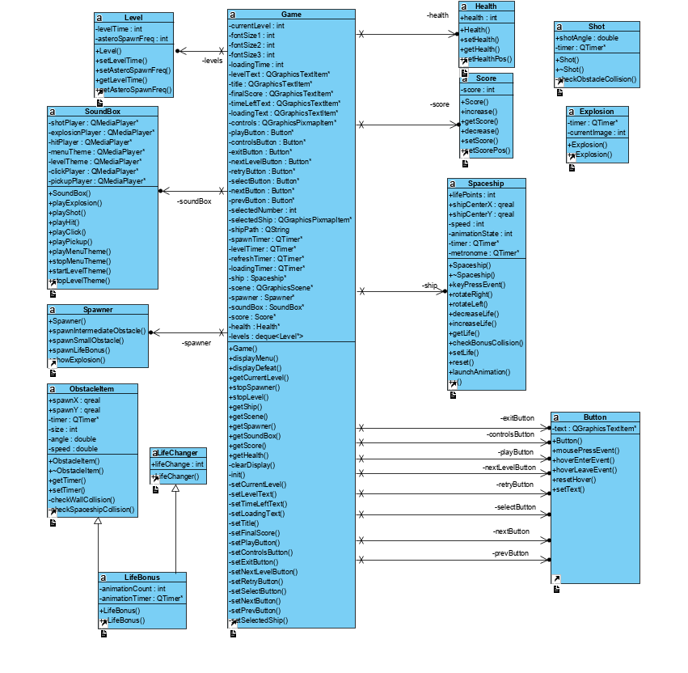
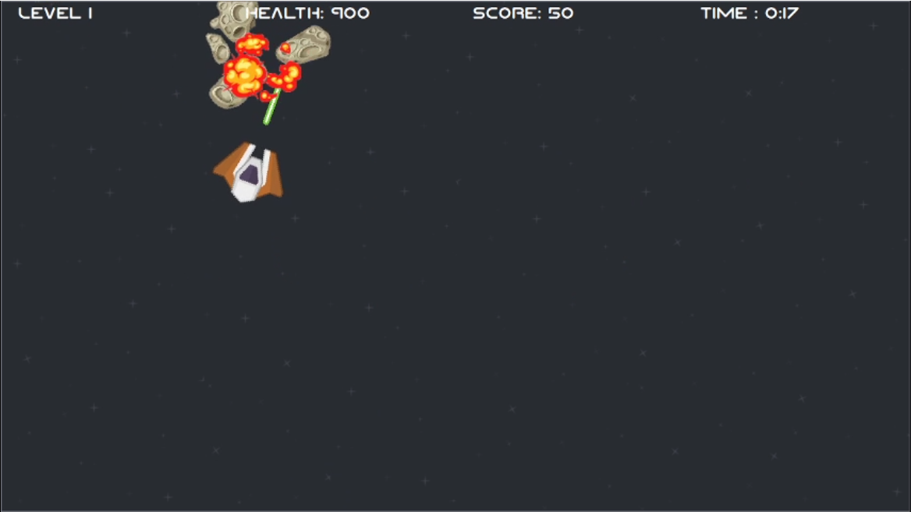

# AsteroidsDestruction
* A C++ school project which is a little arcade game with a basic shoot system. We are learning Qt and C++ at the same time by our own.

* The player's objective is to survive at Asteroid waves by avoiding and destroying them. Destroying big asteroid will make appear some smaller ones and life/weapon bonus.

# Classes Diagram
First idea class diagram :

# Preview
A little view created in Adobe Illustrator to show what the game should look like.

What the game is actually looking.

# Features to add or structure to follow

## > To add on Game Structure part (Game, levels, ...)

* Use a STL of level in the game instance. !important

## > To add on Gameplay part (Items, movements, ...)

* Add exception handling. !important
